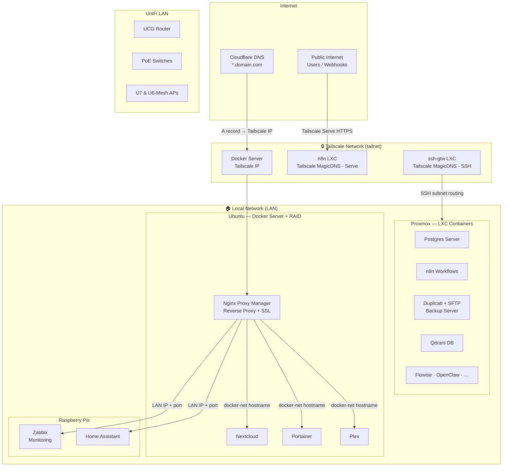
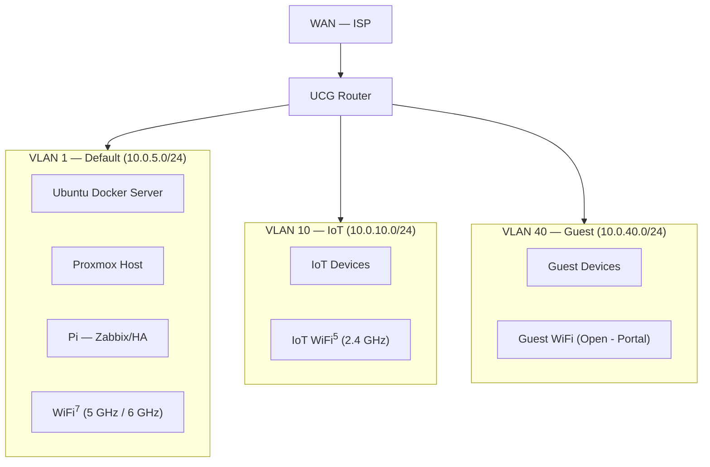
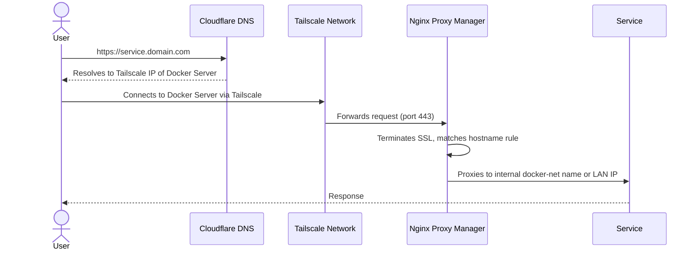
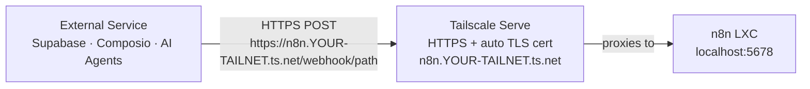

# Home Lab

## Table of Contents

- [The Problem](#the-problem)
- [Architecture Overview](#architecture-overview)
- [Network Infrastructure](#network-infrastructure)
- [VLAN Topology](#vlan-topology)
- [Tailscale — The Security Backbone](#tailscalethe-security-backbone)
  - [Where Tailscale is installed](#where-tailscale-is-installed)
  - [Traffic routing](#traffic-routing)
  - [MagicDNS](#magicdnshow-tailscale-names-nodes)
  - [Public endpoints via Tailscale Serve](#public-endpoints-via-tailscale-serve)
- [Services Reference](#services-reference)
- [Setup Guide](#setup-guide)
- [Validation](#validation)
- [Reflection](#reflection)


---

This README documents my Home-Lab setup and why I chose each component. It's not meant to be a detailed how-to; I made it mostly for my own use, but it does show how anyone can implement a self-hosted infrastructure built around a **Zero Trust Network Access** model using [Tailscale](https://tailscale.com), [Docker](https://docker.com), [Proxmox](https://proxmox.com) and Nginx Proxy Manager [NPM](https://nginxproxymanager.com).

## The Problem

If you're setting up your Home-Lab only for internal use and you don't ever expect to reach a service or troubleshoot a problem from outside, then you could set up a private LAN, close everything in your router, and live within closed walls.

However, that is ineffective for the majority of people (think you being @work, @vacation and wanting to access something in your LAN, or wanting to deploy a website or expose a service).

The dilemma then is to either expose your network to the public internet and accept the attack surface or use one of the more conventional workarounds, each of which has costs:

### Why not a traditional VPN, bastion, or port-forwarding?
- **Port forwarding** punches holes directly in your firewall—every exposed port is a target, with no authentication layer in front of your service. 
    * <small> *My own experience here is that 5 minutes after I forwarded port 80 for a web server, I was already getting probes from an insane amount of IPs, and I'm not exaggerating, 5 minutes!*</small>
- **Self-hosted VPN (WireGuard, OpenVPN)** works, but follows a hub-and-spoke model: all traffic routes through your VPN server, which itself needs an open inbound port and ongoing key management. If the VPN server goes down, everything goes with it.
- **Bastion-Jump host & reverse proxy** reduces surface area but adds complexity; still requires an open SSH port for Jump and SSL and HTTP opened ports for Reverse Proxy.
   - <small> I have tried both (Bastillion & Guacamole as jump hosts) and NginxProxyManager for reverse proxy. It still created an attack surface on my servers, and hardening them took a lot of effort. In the end I did keep the reverse proxy, as you will see, but behind a Tailscale Network</small>

**Tailscale** solves all three problems. It creates an encrypted peer-to-peer overlay network (built on WireGuard) where every node authenticates via identity—not IP or firewall rules. No inbound ports are opened on the router. Access is granted per-node with least privilege. And features like MagicDNS and Tailscale Serve handle the naming and public-endpoint problems that would otherwise require additional infrastructure.

| Approach | What it requires | What it leaves open |
|---|---|---|
| **Port forwarding** | Nothing—just forward the port | Service is internet-exposed with no auth layer in front |
| **Self-hosted VPN** (WireGuard/OpenVPN) | VPN server with a public IP, open UDP/TCP port, key management | Hub-and-spoke: VPN server is a single point of failure; all traffic routes through it |
| **Bastion / jump host** | Public-facing SSH server, open port 22, key distribution | Still one open inbound port; only helps with SSH, not web services |
| **Cloudflare Tunnel** | Cloudflare account, `cloudflared` daemon | Viable, but HTTP/HTTPS only, vendor lock-in, no peer-to-peer SSH |
| **Tailscale** | An account and the `tailscale` package on each node | Nothing—zero open inbound ports on the router |

This lab documents a real production home-lab where Tailscale is the security backbone—not bolted on as an afterthought, but designed in from the start as the access layer for everything.

In this setup, Tailscale gives us:
- **Zero open ports** on the router—the UCG Max has no forwarding rules whatsoever
- **Per-node, identity-based access** — a node is either on the tailnet or it isn't; no shared keys, no IP allow-lists
- **MagicDNS** — stable hostnames without managing DNS records or knowing IPs
- **Tailscale Serve** — selective HTTPS exposure for one service (n8n) without exposing anything else
- **SSH via tailnet** — direct encrypted SSH to any LXC that has Tailscale, with no jump host needed

---

### Prerequisites

Before following the setup guide, you will need:

- A [Tailscale](https://tailscale.com) account (the free tier covers this entire setup)
- A registered domain with DNS: I used [Cloudflare](https://cloudflare.com)
- VM Servers: To host your services, I use 2 approaches: Docker VMs and Proxmox for Linux Containers
    - [Ubuntu](https://ubuntu.com/) Server machine with [Docker](https://www.docker.com/) installed.
    - [Proxmox](https://proxmox.com) host for LXC containers
- Your network stack that allows for VLAN configurations.
    - I use [UniFi](https://ui.com/) network gear (UCG + switches/APs)
- Optional hosts (I use Raspberry Pis) for [Zabbix](https://www.zabbix.com/) (monitoring) and Home Assistant (IoT)
    - Separate RPis to be independent of Docker/Proxmox health
- Basic familiarity with Linux, Docker Compose, Proxmox, and SSH
    - <small>All of the services/software used have free tiers/community editions  </small>
---
## Architecture Overview

The lab consists of two main servers, two Raspberry Pis, and a UniFi-managed internal network. Tailscale acts as the secure overlay network that ties everything together.



---

## Network Infrastructure

My home network consists of a **UniFi** network stack:

| Component | Role |
|---|---|
| UCGateway | Router / gateway / firewall |
| PoE Switches | Ethernet backbone for servers |
| U7 AP | WiFi 6<sup>Ghz</sup> = PC/Smartphones |
|U6-Mesh| WiFi 2.4<sup>Ghz</sup> = IoT devices|

No ports are forwarded on the router and firewall blocks any incoming attempt. All allowed inbound access flows through Tailscale.

---

## VLAN Topology

Three networks segmented at the UniFi layer. Servers and trusted devices live on the Default network; IoT and guests are isolated.

| VLAN ID | Name | Subnet | WiFi SSID | Auth |
|---|---|---|---|---|
| 1 | Default | `10.0.5.0/24` | M5 (5 GHz + 6 GHz) | WPA2/WPA3 |
| 10 | IoT Network | `10.0.10.0/24` | MIoT (2.4 GHz) | WPA2 |
| 40 | Guest Network | `10.0.40.0/24` | MGuest (2.4 GHz) | Open |



> <small>**Note on IoT ↔ Default routing:** Home Assistant (VLAN 1) needs to reach IoT devices (VLAN 10). This is handled via firewall rules on the UCG Max allowing HA's IP to initiate connections to VLAN 10, while blocking the reverse.</small>

---

## Tailscale—The Security Backbone

Tailscale implements a **Zero Trust Network Access** model: every node must authenticate, and access is granted per-node with least privilege options through ACL/Grants. 

Tailscale setup is simple:
- You go to tailscale.com and create your account
    - <small>To setup you will use one of your identity providers (Google, Apple, Microsoft, GitHub), which allows for MFA and passkey.</small>
- From there you will be guided on how to download the client for your devices (Linux, MacOS, iOS, Windows, Android), and when you install on that device, you log in with the same identity provider. **That's it!**
- Your device is now on the network and has its own Tailscale IP and MagicDNS name.
    - <small>Install the client on your laptop or smartphone, and you have immediate and secure access to your device from the internet, no exposing a port in your router, no firewall rule to configure; it just works.</small>
- The [admin console](https://login.tailscale.com/admin) allows you to manage all your devices.

>💡<small>**Tailscale** has many other features that allow you to control specific access inside your private network (Grants), Define a client as an exit node (So you can route your internet activity through a trusted node in your network) or create a subnet (to allow access to a subnet or specific devices where you can't install the client like printers), I will give examples of this in the specific nodes I use it</small>


### Where Tailscale is installed.

| Node / Server | Why |
|---|---|
| Docker Server (host) | Receives all `*.domain.com` web traffic via Cloudflare DNS pointing to its Tailscale IP, and NPM Reverse Proxy redirects it internally. |
| n8n LXC | Needs a public HTTPS URL for webhooks and MCP server endpoints (via Tailscale Serve) |
|ssh-gtw LXC| Acting as a subnet router that allows for SSH and HTTP/S access to the rest (details below)
| Postgres LXC |  To be able to access Postgres port 5432 |
| Client Devices| Laptops, Smartphones and Desktop - all have Tailscale Installed|

>**Tailscale Subnet Routing:**<small> Tailscale allows you to define a node that acts as a router to one of your subnets. In this case I have it setup to access the rest of the LXCs; I could install Tailscale directly in each LXC, and for "production" LXC thats the preferred way, but I play a lot with new LXCs and this allows me to access them immediately without installing a client.

Services that do **not*** need Tailscale (e.g., Organizr, Homebridge) have no Tailscale node—they are only reachable through Nginx Proxy Manager, which itself sits behind the Docker Server's Tailscale IP.

> \* <small>The reverse proxy is not strictly necessary here; you could install Tailscale in each host and reach it via its MagicDNS name, but I wanted to use my own domain name, and where I don't need ssh or specific ports besides 80/443 access, I'm not currently including them in the Tailscale network.</small>

### Traffic routing



### MagicDNS—how Tailscale names nodes

Every node on the tailnet automatically gets a stable DNS name managed by Tailscale:

```
<node-name>.YOUR-TAILNET.ts.net
```

No manual DNS configuration is required—Tailscale's control plane provisions and maintains these records. On any device in the tailnet, you can reach `hostname.YOUR-TAILNET.ts.net` directly, without knowing an IP address. It also manages a search domain so you can reference any node just by its host name `ssh hostname`. The MagicDNS URL is used for SSH access, inter-service calls, and as the foundation for Tailscale Serve.

### Public endpoints via Tailscale Serve

For services that need to be reachable by external cloud platforms (e.g., n8n webhooks, MCP servers called by AI agents), **Tailscale Serve** exposes a local port on the node's MagicDNS name with auto-provisioned HTTPS—no reverse proxy, no certificate management, no port forwarding needed.



**How the n8n webhook URL is constructed:**

| Part | Value |
|---|---|
| Scheme | `https://` — Tailscale provisions the cert for `*.ts.net` |
| Host | `n8n.YOUR-TAILNET.ts.net` — MagicDNS name of the n8n LXC |
| Path | `/webhook/<workflow-path>` — set in the n8n Webhook node |

**Full example:** `https://n8n.YOUR-TAILNET.ts.net/webhook/path`

Tailscale handles TLS termination. The n8n LXC only ever listens on `localhost:5678` — it is never directly exposed, even within the tailnet.


---

## Services Reference

### Docker Server (Ubuntu + RAID)

The Docker host also serves as the **media and file server** via attached RAID storage.

| Service | Purpose | Access |
|---|---|---|
|**Nginx Proxy Manager** | Reverse proxy + SSL termination - * wildcard for Domain  | Direct Tailscale IP<br/>`*.domain.com` |
| **Portainer** | Docker container management UI | Via reverse proxy <br/>ex. `portainer.domain.com`|
| **Organizr** | Home Lab Dashboard | Via reverse proxy |
| **Nextcloud** | Self-hosted cloud storage and file sync | Via reverse proxy|
| **Plex** | Media management and streaming | Via reverse proxy |
| **Homebridge** | HomeKit bridge for non-native smart home devices | Via reverse proxy |

>NPM Example Configs: NPM Redirects any `*.domain.com` if it finds a corresponding host in its DB and points it to either an internal IP `10.0.x.x:port` or a Docker `host:port` 

> 📷 *Screenshot: `NPM-1.png` — add a screenshot of your NPM proxy host list here.*

### Proxmox (LXC Containers—Debian 12)

| Container | Purpose | Access |
|---|---|---|
| **n8n** | Workflow automation, webhooks, MCP server | `n8n.domain.com` Tailscale Serve |
| **Postgres** | Shared database server for Docker apps and LXCs | LAN IP / Tailscale IP |
| **ssh-gtw** | LXC serving as SFTP and ssh routing | Tailscale IP - ssh |
| **Qdrant** | Vector database for RAG pipelines | LAN IP / Tailscale IP |
| **Rest of LXCs** *(testing)* | Flowise, Openclaw, Node4js, etc. | Through Tailscale Subnet Routing |

### Raspberry Pi

| Device | Purpose | Access |
|---|---|---|
| **Pi — Zabbix** | Infrastructure monitoring and observability | `zabbix.domain.com` |
| **Pi — Home Assistant** | Home automation hub | `ha.domain.com` |

---

### DNS & SSL

For the Tailscale Network `YOUR-TAILNET.ts.net`
- DNS is managed by Tailscale MagicDNS
- All SSL certificates are also managed by Tailscale.
- Public exposed URL through Tailscale (nothing is opened in Router)

For the `domain.com`
- Domain registered and managed in **Cloudflare**
- DNS records:
  - `A` record: `domain.com` → Tailscale IP of Docker Server
  - `CNAME` wildcard: `*.domain.com` → `domain.com`
- All SSL certificates are issued and renewed by **Nginx Proxy Manager** (Let's Encrypt)
- No certificate management needed on individual services

---

### Backup Strategy

- **Duplicati** runs scheduled backups from servers and hosts data volumes to 2 backup targets:
    - Remote target: BackBlaze S3 Buckets. 
    - Local target: SFTP server (LXC), writing to SD-Drive for portable storage)
- Backup access gated behind Tailscale SSH

---

### Monitoring & Observability

**Zabbix** (Raspberry Pi) monitors the full stack—servers, LXCs, and network devices. Dashboards are accessible via Nginx Proxy Manager like all other web services.

---


## Setup Guide

A bootstrap sequence for reproducing this lab from scratch. Each phase assumes the previous is complete.

### Scripts

Ready-to-use compose files and setup helpers are in the [`scripts/`](./scripts/) folder.

| Script | Purpose |
|---|---|
| [`docker-compose-core.yml`](./scripts/docker-compose-core.yml) | Nginx Proxy Manager + Portainer. Run first—creates shared Docker networks. |
| [`docker-compose-example-service.yml`](./scripts/docker-compose-example-service.yml) | Template for attaching any service to the proxy network. |
| [`validate.sh`](./scripts/validate.sh) | Runs all connectivity checks—Tailscale status, MagicDNS ping, SSH reachability, server endpoint, domain chain, DNS. |

See [`scripts/README.md`](./scripts/README.md) for the full network architecture and quickstart.

### Phase 1 — Network (UniFi)

1. Factory reset and adopt all UniFi devices into the UniFi Network via UCG Max
2. Create VLANs: Default (1 / 10.0.5.0/24), IoT (10 / 10.0.10.0/24), Guest (40 / 10.0.40.0/24)
3. Create WiFi networks and bind each to its VLAN (Main → VLAN 1, IoT → VLAN 10, Guest → VLAN 40)
4. Set firewall rules:
    - Isolate Guest from all other VLANs
    - Block IoT → Default and → Guest
    - Allow Default → IoT (for Home Assistant)
5. Assign static IPs to servers via DHCP reservations.

### Phase 2 — Tailscale (Accounts & Keys)

1. Create a [Tailscale account](https://tailscale.com) and note your tailnet name (`YOUR-TAILNET.ts.net`)
2. Enable **MagicDNS** in the Tailscale admin console (DNS tab)
3. Optionally enable **HTTPS certificates** for `*.ts.net` in the admin console—required for Tailscale Serve

### Phase 3—Docker Server (Ubuntu)

1. Install Ubuntu Server, attach and configure RAID
2. Install Docker + Docker Compose
3. Install Tailscale on the **host**:
```bash
curl -fsSL https://tailscale.com/install.sh | sh
sudo tailscale up
```
4. Note the assigned Tailscale IP—this is the address Cloudflare will point to
5. Deploy containers (Portainer first, then manage the rest via Portainer):
- Nginx Proxy Manager
- Organizr 
- Nextcloud

### Phase 4 — Proxmox & LXC Containers

1. Install Proxmox 8 on the host machine
2. Create Debian 12 LXC templates and provision containers
3. For each LXC that needs SSH access or Tailscale Serve, install Tailscale **inside the LXC**:
```bash
curl -fsSL https://tailscale.com/install.sh | sh
sudo tailscale up
```
4. **n8n—enable Tailscale Serve:**
``` bash
# Expose n8n's local port publicly via Tailscale HTTPS
sudo tailscale serve --bg --https=443 http://localhost:5678
```
This makes `https://n8n.YOUR-TAILNET.ts.net` reachable from the internet with auto-provisioned TLS.
5. Deploy remaining LXC services: Postgres, Duplicati/SFTP, Qdrant

### Phase 5 — Raspberry Pis

1. Flash Raspberry Pi OS on each Pi
2. Connect to VLAN 1 and assign static IPs via DHCP reservations
3. Install services:
   - **Pi 1:** Zabbix Server + Web frontend
   - **Pi 2:** Home Assistant OS
4. Add each Server as a Zabbix host for monitoring

### Phase 6 — DNS & Reverse Proxy

1. In **Cloudflare**, create:
```
A       domain.com    →  <Tailscale IP of Docker Server>
CNAME   *.domain.com  →  domain.com
```
Set both records to **DNS only** (grey cloud—not proxied), so traffic goes directly to the Tailscale IP
2. In **Nginx Proxy Manager**, create proxy hosts for each service:
   - Match on the public hostname (e.g., `ha.domain.com`)
   - Forward to the internal docker-net name or LAN IP + port
   - Enable **SSL** and request a Let's Encrypt certificate for `*.domain.com` wildcard
3. Verify end-to-end: `https://service.domain.com` → Cloudflare → Tailscale → NPM → service

### Phase 7 — Backups (Duplicati)

1. On the backup LXC, start the SFTP server and mount the SD-Drive
2. In Duplicati (can run as a Docker container in the LXC and PCs), configure backup jobs pointing to the BackBlaze and SFTP destination
3. Schedule jobs and verify restore works before relying on it
---
## Validation

The [`scripts/validate.sh`](./scripts/validate.sh) script runs all checks below automatically. To run it:

```bash
chmod +x scripts/validate.sh
./scripts/validate.sh
```

### 1 — Tailscale node status

Run on any tailnet node to confirm all expected nodes are online:

```bash
tailscale status
```

Expected output includes the Docker Server, n8n LXC, Postgres LXC, Duplicati LXC, and Qdrant LXC, each with a `100.x.x.x` address and an `active` or `idle` state.

### 2 — Peer-to-peer connectivity

```bash
# From any tailnet node, ping the Docker Server by MagicDNS name
tailscale ping docker-server

# Ping the n8n LXC
tailscale ping n8n
```

A successful ping confirms direct WireGuard path establishment between the two nodes, not relayed traffic.

### 3 — SSH via MagicDNS

```bash
# SSH into a Proxmox LXC by name — no IP address, no jump host
ssh user@n8n
ssh user@postgres
```

Successful connection proves MagicDNS resolution is working and Tailscale SSH routing is functional.

### 4 — Tailscale Serve (n8n public endpoint)

Run on the n8n LXC to confirm the server is active:

```bash
tailscale serve status
```

Expected output shows port 443 forwarding to `http://localhost:5678`.

Probe the public endpoint from outside the tailnet:

```bash
curl -s -o /dev/null -w "%{http_code}" https://n8n.YOUR-TAILNET.ts.net/healthz
# Expected: 200
```

### 5 — Web service via domain → Tailscale → NPM

Confirms the full chain: Cloudflare DNS → Tailscale IP → Nginx Proxy Manager → internal service.

```bash
# From a device on the tailnet (resolves via Cloudflare → Tailscale IP)
curl -s -o /dev/null -w "%{http_code}" https://cloud.domain.com
# Expected: 200 or 302 (Nextcloud login redirect)

curl -s -o /dev/null -w "%{http_code}" https://ha.domain.com
# Expected: 200 (Home Assistant)
```

### 6 — Confirm no ports are open on the router

On the UCG Max, verify the port forwarding table is empty. Alternatively, scan from outside the tailnet:

```bash
# Run from a machine NOT on the tailnet (e.g. a phone on mobile data)
nmap -Pn <WAN-IP> -p 22,80,443,8080
# Expected: all ports filtered/closed
```

---

## Reflection

### What worked well
The Home Lab has gone through several iterations and configurations since inception, each time with improvements on what was initially implemented. Docker was my initial VM server and that made it fairly easy to start deploying both back-end and front-end of services.

My initial network was very limited in terms of VLAN and firewall management, but once I moved to UniFi network the level of control and details I have are very good.

Tailscale was what made it all possible once I started exposing services and accessing servers remotely, it was a painless setup that just worked right away and was secure.

Proxmox was a second addition to the setup, but it has proven to be a very good option (and less demanding in resources than Docker VM's). For certain services like Postgres performance is better with less resource consumption than Docker

### What was difficult or surprising
The "uncomfortable" experience of having hundreds of probes in less than 5 minutes when I tried port forwarding on the router was what drove me to seek an alternative, and how I found Tailscale and was amazed by the ease of use and no-cost option to deploy for personal use.

Trying to setup a reverse proxy to initially mitigate the attack surface (before tailscale) was difficult and was not really the best solution. 

### What I would do differently with more time
My initial setup of Tailscale was a basic one, and although at the time it was what I needed to deploy fast and without a fuss, I wish I had spent a little more time understanding all the options I had with it and designing my network flows better. There are things that may not be needed or could be simplified, and others that I could implement to work better (local UniFi DNS alignment, Tailscale ssh directly, more restricted ACL)

---

### AI Disclosure

This documentation was produced with AI assistance (Claude, via Anthropic's Cowork tool).

**What AI was used for:**
- Validating my initial README against gaps vs. exercise instructions
- Creating Mermaid diagrams for the architecture and traffic flow
- Writing Docker Compose files based on the actual `NPM.yaml` config I provided
- Drafting the setup guide phases and validation commands
- Structuring the "vs. traditional approaches" comparison table

**What I reviewed and changed myself:**
- All architecture decisions and Tailscale configuration reflect my actual running setup
- Updated service lists, node names (ssh-gtw), and backup strategy (added BackBlaze target)
- Filled in all reflection content from personal experience
- Corrected Tailscale Serve command syntax and removed outdated flags
- Rewrote the problem framing and prerequisites sections with my own context and personal anecdotes
- Verified every validation command against my live environment

**Where AI was helpful:**
- Identifying gaps between what I had written and what the exercise required
- The comparison table was a solid starting point — I verified each row against my own experience
- Keeping private details (domain, Tailscale network name, public IPs, internal IPs) out of the public doc

**Where AI was wrong or incomplete:**
- Initial Docker Compose draft used different network names (`proxy`/`internal`) — corrected once I provided the real `NPM.yaml`
- Some Tailscale commands used outdated syntax and needed correction
- First diagram draft had Raspberry Pis incorrectly nested inside the Docker Server subgraph

---

### Private Details

Sensitive values (IPs, actual hostnames, Tailscale node addresses, credentials) are documented in `private.md`, which is excluded from this repository via `.gitignore`.
